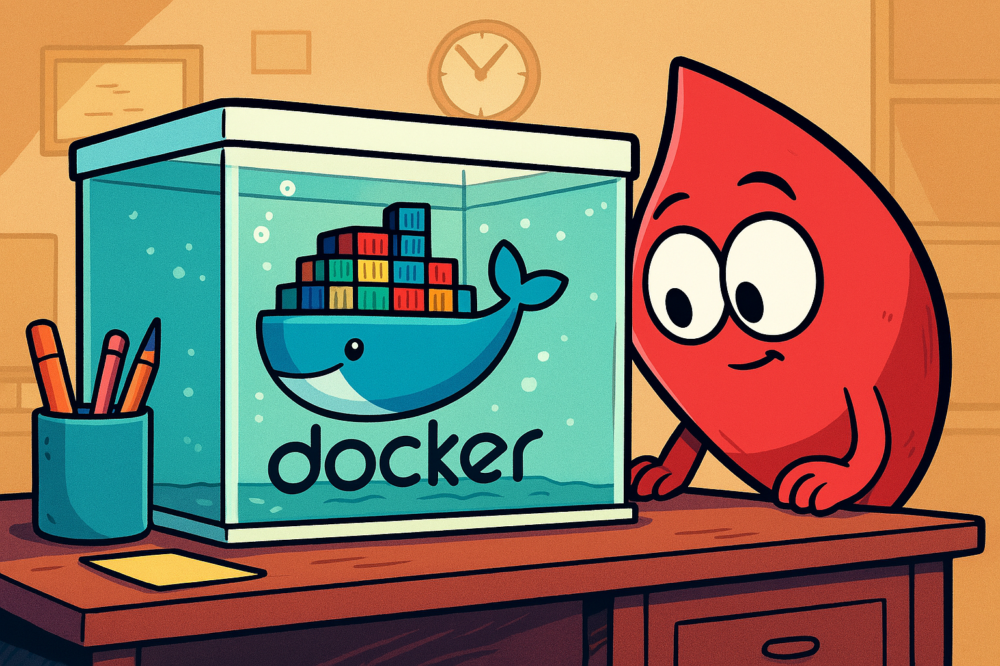

# dummy-api



## 📚 Table of Contents
- [dummy-api](#dummy-api)
  - [📚 Table of Contents](#-table-of-contents)
  - [🧠 Description](#-description)
  - [🛠️ Requirements](#️-requirements)
  - [🤖 Installation](#-installation)
  - [🚀 Testing](#-testing)

## 🧠 Description

This is a dummy API written in Ruby (Sinatra) for network testing and prototyping purposes.

## 🛠️ Requirements

- Ruby (version 3.3 or higher)

## 🤖 Installation

1. Clone the repository:

   ```bash
   git clone https://github.com/mikelogaciuk/dummy-api.git

    cd dummy-api
    ```

2. Install dependencies:

   ```bash
   bundle install
   ```

3. Run the application:

   ```bash
   rake run
   ```

It runs on port `4567` by default.

## 🚀 Testing

There is a simple test suite included. To run the tests, use:

```bash
bundle exec ruby ./test/test_dummy_api.rb
```
